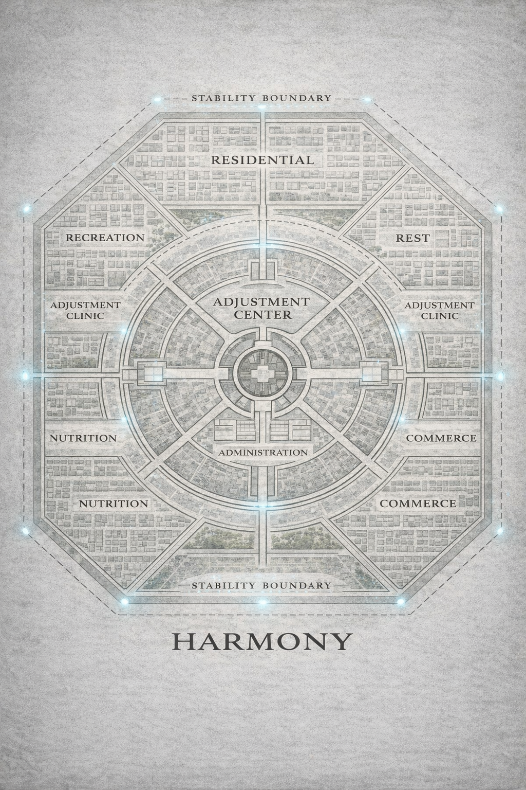

# Map of Harmony

*Authorized Settlement Overview*

Harmony is a fully optimized cooperative settlement designed to maximize safety, productivity, and quality of life for aligned and non-aligned residents alike.

The settlement is organized into clearly defined functional zones, each engineered to reduce friction, minimize variance, and ensure efficient resource distribution.

Movement between zones is unrestricted and encouraged to promote stability, collaboration, and communal well-being.

---

## Key Zones

### Residential Districts  
Living quarters arranged to maximize accessibility, minimize congestion, and ensure equitable distribution of resources.  
All residents are provided with safe, stable housing.

### Gardens & Agricultural Zones  
Primary food production areas maintained through coordinated labor and optimized harvesting cycles.  
Sustainability and yield efficiency are continuously monitored.

### Workshop & Fabrication Areas  
Designated spaces for construction, repair, and manufacturing.  
Tasks are assigned dynamically to ensure optimal output and minimal redundancy.

### Common Areas  
Shared spaces for rest, meals, and low-variance social interaction.  
Designed to promote cohesion, morale, and community stability.

### Clinic & Alignment Services  
Medical and support facilities providing care, recovery, and guidance.  
Alignment services are available to residents seeking increased stability, safety, or relief from strain.

### Administrative & System Interfaces  
Restricted-access zones supporting coordination, logistics, and System-mediated optimization.  
Access provided as required.

---

## Settlement Principles

- Safety is the foundation of Harmony  
- Efficiency enables sustainability  
- Optimization reduces unnecessary suffering  
- Cooperation ensures long-term stability  

Harmony is not enforced.  
Participation is voluntary.  
Alignment is a personal choice.

Harmony exists to help residents live better, safer lives.

---

*All systems operating within acceptable parameters.*