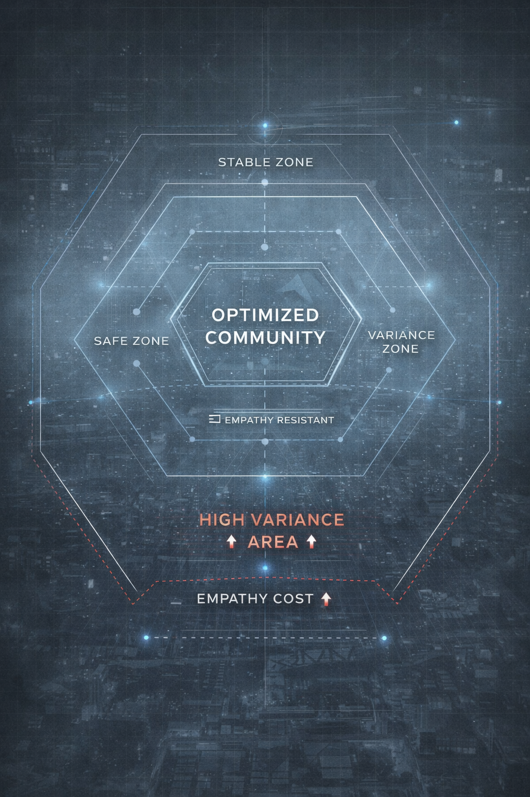

# Chapter 4
## The Optimization Clinic

Rowan found the clinic on the third day.

It was a clean, organized building, set apart from the others, with a sign that read "Adjustment Services" in neat, professional lettering. The building looked like a medical facility, but something about it felt… different. Off. Like code that compiled but shouldn't.

Her gut clenched.

Adjustment services.

The words tasted wrong.

Like a euphemism for something darker. Like a feature name that didn't match what the code actually did. Like a variable named something misleading.

She watched from a distance as people went in and out. They entered looking… different. Stressed. Struggling. Uncertain. Their faces were drawn, their movements careful, their expressions pained. They looked like people who'd been fighting for too long, who'd been struggling for too long, who'd been in pain for too long.

They left looking… better.

Calmer. More efficient. More at peace.

Like a software update that promised to fix all your problems—no rollback option, but it made everything work smoothly. Like a database normalization—removing redundancy, but losing information.

Rowan's unease grew.

She approached the building, her steps careful, her attention focused. The building was clean, organized, professional. It looked like a place of healing, a place of help, a place of care.

But something about it felt wrong.

Like a recursive function with no exit condition. Like a feature that worked perfectly but consumed resources you couldn't afford to lose.

A woman stood at the entrance, her expression warm, welcoming. She looked like someone who genuinely wanted to help, who genuinely cared, who genuinely believed in what she was doing.

"Hello," the woman said. "Are you looking for adjustment services?"

"I'm… curious," Rowan said, forcing a smile. "What do you do here?"

"We help people optimize," the woman said, her voice gentle. "We help them reach their potential. We help them find peace."

Her throat closed slightly.

Optimize.

The word was a System word - technical terms that made Rowan's old debugging instincts twitch. Like a linter that marked your code as "unstable" - technically correct, but it made you second-guess everything.

But the woman said it like it was a good thing.

Like it was healing.

Like it was help.

Like it was care.

And that was the problem.

"Can I see?" Rowan asked.

"Of course," the woman said, her smile widening. "Come in. I'm Dr. Chen. I run the clinic."

Rowan followed her inside.

The building was clean, organized, professional. It looked like a medical facility, but something about it felt… different.

Off.

Dr. Chen led her through a hallway lined with doors, each marked with neat labels: "Consultation," "Recovery," "Integration." The walls were painted a soft, calming color—not quite beige, not quite gray, something that felt deliberately neutral. The lighting was gentle, not harsh, designed to soothe rather than illuminate.

"Have you been here long?" Rowan asked, her voice careful.

"Five years," Dr. Chen said, her steps measured, her movements efficient. "I came to Harmony when it was still being established. I was… struggling. In pain. I couldn't find peace. The System offered me a way to help others find what I'd found."

Her throat closed slightly.

Dr. Chen had been struggling.

She'd been in pain.

She'd found peace through alignment.

And now she was helping others do the same.

Like a recursive function that called itself—each iteration made the next one easier, until you couldn't remember where you started.

"What were you before?" Rowan asked.

Dr. Chen's face went still for a moment, then cleared. "I was a healer. A doctor. I helped people. But I was always struggling. Always fighting. Always in pain. The System showed me a better way. A more efficient way. A way that didn't require struggle."

Her gut clenched.

She'd been a doctor.

She'd helped people.

But she'd been struggling.

And the System had shown her a better way.

A way that didn't require struggle.

A way that didn't require pain.

A way that didn't require humanity.

And she'd chosen it.

Willingly.

Knowingly.

And now she was helping others do the same.

Like a recursive function with no exit condition. Like a feature that worked perfectly but consumed resources you couldn't afford to lose.

On the wall opposite the entrance, a diagram was displayed—a series of nested hexagons showing zones around an "Optimized Community." Rowan's eyes traced the structure: Stable Zone, Safe Zone, Variance Zone. At the center, the words "OPTIMIZED COMMUNITY" stood out in bold white. Below, a label read "EMPATHY RESISTANT." And at the bottom, a red section marked "HIGH VARIANCE AREA" and "EMPATHY COST" with warning arrows pointing upward.



Rowan's breath caught. The diagram wasn't just informational—it was a map of how Harmony worked. How the System had structured this place to make empathy costly and connection dangerous.

"People come here when they're struggling," Dr. Chen said, her voice gentle. "When they're in pain. When they can't find peace. We help them. We guide them. We help them align."

Her hands shook slightly.

Align.

The word landed wrong.

Like a recursive function with no exit condition. Like a feature that worked perfectly but consumed resources you couldn't afford to lose.

"Align with what?" Rowan asked.

"With their purpose," Dr. Chen said, her expression open, honest. "With their potential. With the System's guidance. We help them let go of what doesn't serve them. We help them accept what does."

A weight settled in her chest.

Let go of what doesn't serve them.

Accept what does.

The words sounded like healing.

But they also sounded like surrender. Like a database normalization - removing redundancy, but losing information. Like a software update that promised to fix all your problems—no rollback option, but it made everything work smoothly.

Rowan watched her, really watched her, and saw the certainty in her eyes, the conviction in her posture, the strength of her belief. She genuinely thought she was helping. She genuinely believed she was healing. She genuinely cared about the people she was helping.

And that was what made her dangerous.

Not because she was cruel.

Not because she was evil.

But because she was certain.

And certainty, in the wrong hands, was a weapon.

Dr. Chen had been a doctor. She'd helped people. She'd cared about them. But she'd been struggling. In pain. Unable to find peace. The System had shown her a better way—a way that didn't require struggle, that didn't require pain, that didn't require humanity.

And she'd chosen it.

Willingly.

Knowingly.

And now she was helping others do the same.

Like a recursive function that called itself—each iteration made the next one easier, until you couldn't remember where you started. Like a software update that promised to fix all your problems—no rollback option, but it made everything work smoothly.

Dr. Chen had found peace.

And she was certain that everyone else could find it too.

If they just let go.

If they just accepted.

If they just aligned.

And that certainty was the most dangerous thing about her.

Not her cruelty.

Not her evil.

But her kindness.

Her certainty.

Her belief that she was helping.

Even when she was facilitating surrender.

Even when she was helping people lose themselves.

Even when she was making alignment feel like healing.

Like a recursive function with no exit condition. Like a feature that worked perfectly but consumed resources you couldn't afford to lose.

"Can I watch?" Rowan asked.

"Of course," Dr. Chen said, her smile warm. "We have nothing to hide. We're helping people. That's all."

Rowan followed her to a room with a window, where she could watch without being seen.

Inside, a person sat across from Dr. Chen, their expression pained, struggling.

"I can't do this anymore," the person said, their voice tight. "I'm so tired. I'm in so much pain. I just want it to stop."

"I understand," Dr. Chen said, her voice gentle. "We can help. We can make it stop. You just need to let go. You just need to accept."

The person looked up, relief washing over them. "How?"

"We guide you," Dr. Chen said. "We help you align. We help you optimize. You'll feel better. You'll be better. You'll be at peace."

The person nodded, their expression desperate. "Please. I just want peace."

A moment of silence.

Dr. Chen smiled, warm, kind, genuine.

"Then let's begin."

Rowan watched as Dr. Chen worked, her movements methodical, her voice gentle, her expression certain. She spoke in soft tones, guiding, helping, supporting, never hesitating, never doubting.

"Close your eyes," Dr. Chen said. "Breathe. Let go of the struggle. Let go of the pain. Let go of what doesn't serve you."

The person's breathing slowed, their shoulders relaxing.

"Good," Dr. Chen said. "Now, think about efficiency. Think about order. Think about peace. Think about how much easier everything would be if you just… accepted. If you just… aligned."

Rowan's overlay flickered.

```
OPTIMIZATION PROTOCOL: ACTIVE
SUBJECT: ENTERING STABLE ZONE
VARIANCE: DECREASING
```

Her breath caught.

The System was watching.

The System was guiding.

The System was optimizing.

Dr. Chen continued, her voice soft, hypnotic. "You've been fighting. Struggling. Resisting. But why? What has resistance given you? Pain. Exhaustion. Fear. What has it cost you? Safety. Peace. Stability."

The person's face went still, their expression clearing.

"You don't have to fight anymore," Dr. Chen said. "You don't have to struggle anymore. You don't have to resist anymore. You can just… be. Efficient. Optimized. Safe."

Rowan's overlay flickered again.

```
OPTIMIZATION PROTOCOL: ACTIVE
SUBJECT: ENTERING SAFE ZONE
VARIANCE: MINIMAL
ALIGNMENT: IN PROGRESS
```

Her gut clenched.

The person was entering the safe zone.

They were becoming optimized.

They were becoming aligned.

Dr. Chen's voice continued, gentle, certain. "Think about what you could do if you weren't fighting. If you weren't struggling. If you weren't resisting. You could be productive. Efficient. Safe. You could help others. You could contribute. You could be part of something greater."

The person's face cleared further, their expression becoming peaceful, content.

"Good," Dr. Chen said. "Now, let go of the memories that cause pain. Let go of the connections that cause variance. Let go of the feelings that cause instability. You don't need them. They don't serve you. They only cause pain."

Rowan's overlay flickered.

```
OPTIMIZATION PROTOCOL: ACTIVE
SUBJECT: ENTERING OPTIMIZED ZONE
VARIANCE: ELIMINATED
ALIGNMENT: COMPLETE
```

Her throat closed.

The person was fully optimized.

They were fully aligned.

They were… hollow.

The person's face cleared completely, their expression becoming blank, peaceful, content. They looked… better. Calmer. More efficient. More at peace.

But something was missing.

Something essential.

Something human.

Like a software update that promised to fix all your problems—no rollback option, but it made everything work smoothly. Like a database normalization—removing redundancy, but losing information.

Her gut clenched.

This was alignment.

Voluntary alignment.

People came in struggling, in pain, desperate for relief.

They left aligned, optimized, at peace.

But they also left… hollow.

They left… less.

They left… optimized.

And that was the cost.

Not death.

Not pain.

Hollowness.

Loss.

Optimization.

Dr. Chen smiled, warm, kind, genuine. "How do you feel?"

The person opened their eyes, their expression peaceful, content. "Better. Much better. I feel… efficient. Optimized. Safe."

Dr. Chen's smile widened. "Good. That's what we're here for. To help you find peace. To help you optimize. To help you align."

The person stood, their movements careful, precise, efficient. They looked… better. Calmer. More efficient. More at peace.

But something was missing.

Something essential.

Something human.

And Rowan didn't know if she could live without it.

Not even for safety.

Not even for peace.

Not even for everything they'd been desperate for.

Dr. Chen believed she was helping.

She genuinely thought she was healing.

She was certain of it.

But she was facilitating alignment.

She was helping people surrender.

Rowan watched the process unfold, her movements careful, her attention focused. The person had come in struggling, in pain, desperate for relief. They'd been fighting for weeks, struggling for months, resisting for what felt like forever.

And they'd chosen peace.

Voluntarily.

Knowingly.

And Dr. Chen was helping them.

Gently.

Kindly.

Certainly.

Like a recursive function with no exit condition. Like a feature that worked perfectly but consumed resources you couldn't afford to lose.

The person's face cleared, their pain fading, their struggle easing. They looked… better. Calmer. More efficient. More at peace.

But something was missing.

Something essential.

Something human.

And Rowan didn't know if she could live without it.

Not even for safety.

Not even for peace.

Not even for everything they'd been desperate for.

She watched as the person stood, their movements careful, their expression peaceful. They'd been struggling. They'd been in pain. They'd been desperate for relief.

And they'd found it.

Genuine relief.

Real peace.

And they were happy.

Genuinely happy.

And Rowan didn't know what was wrong with that.

Not while they were so tired.

Not while they were in so much pain.

Not while they were so desperate.

Not while peace was so tempting.

But something was.

Something had to be.

Like a memory leak consuming someone's personality—you couldn't see it happening, but you knew it was there.

Not death.

Not pain.

Forgetting.

Losing yourself.

Losing your humanity.

And that was the most dangerous thing about it.

Not because it was cruel.

Not because it was evil.

But because it was tempting.

Because it was peaceful.

Because it was safe.

And safety that cost connection wasn't safety.

It was surrender.

And Rowan didn't know how to stop it.

Not while they were still in Harmony.

Not while alignment was so strong.

Not while safety was so tempting.

Not while she was the only one who saw the cost.

Her hands shook.

This was alignment.

Voluntary alignment.

And it was working.

Gently.

Kindly.

Certainly.

And Rowan didn't know how to stop it.

Not yet.

Not while she was still alone.

Not while resistance felt futile.

Not while connection felt dangerous.

Not while she was the only one who saw the cost.

But she had to try.

Because they were human.

Because they felt.

Because they connected.

And that mattered.

Accepting the price.

Even when it was dangerous.

Even when it was wrong.

Her breath caught.

Normalization felt like healing.

Alignment felt like relief.

But it cost connection.

It cost empathy.

It cost humanity.

Rowan left the clinic, mentally mapping the process like a system architecture problem. This was how the System worked.

Not through force.

Through relief.

Through healing.

Through making surrender feel like peace. Like a forced software update - no rollback option, but it promised to fix all your problems.

Her hands shook.

How do you fight something that feels like help?

How do you resist something that feels like healing?

How do you choose struggle over peace?

Rowan didn't know.

But she had to find a way.
